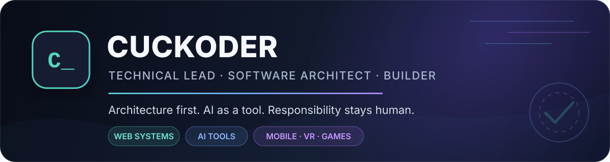
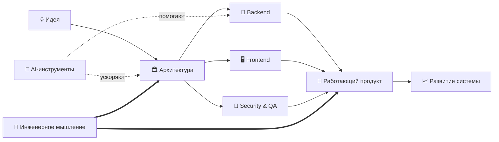

<div align="center">
  
</div>

<div align="center">
  <a href="https://t.me/cuckoders"></a>
  <a href="https://www.youtube.com/@cuckoder"></a>
  <a href="https://github.com/Basarus?tab=repositories"></a>
</div>

## Привет, я Олег 👋

Я — **технический руководитель, software architect и разработчик**. Проектирую веб- и мобильные системы, AI-инструменты, VR-решения и игровые продукты: от идеи и технической стратегии до работающей реализации.

Моя сильная сторона — **архитектура**. Мне интересно не только написать код, но и понять, где проходят границы системы, как она будет развиваться, что произойдёт под нагрузкой и кто потом сможет её поддерживать.

```ts
const cuckoder = {
  roles: ["Technical Lead", "Software Architect", "Mentor"],
  builds: ["web & mobile systems", "AI agents", "VR tools", "game worlds"],
  languages: ["Java", "TypeScript", "C#", "Python", "Go"],
  strongestSkill: "architecture",
  leadershipStyle: ["calm", "responsible"],
  aiPolicy: "power tool, not magic",
} as const;
```

> **AI усиливает разработчика, но остаётся инструментом, а не панацеей.**  
> Архитектуру, решения и ответственность нельзя делегировать автокомплиту.

## Что я умею превращать в систему

<table>
  <tr>
    <td width="50%" valign="top">
      <h3>🏛️ Архитектура</h3>
      Декомпозирую сложные продукты, проектирую границы сервисов, API, модели данных и интеграции. Ищу не самую модную схему, а решение, которое соответствует задаче.
    </td>
    <td width="50%" valign="top">
      <h3>🧭 Техническое руководство</h3>
      Беру полный цикл: техническую стратегию, планирование, качество, развитие команды, delivery и ответственность за итоговое решение.
    </td>
  </tr>
  <tr>
    <td width="50%" valign="top">
      <h3>🧪 Создание продуктов</h3>
      Собираю веб-приложения, desktop-инструменты, игровые платформы и AI-прототипы. Люблю момент, когда идея перестаёт быть документом и начинает работать.
    </td>
    <td width="50%" valign="top">
      <h3>🧑‍🏫 Наставничество</h3>
      Объясняю разработку от первых шагов до проектирования уникальных систем. Обучал лично, внутри команд и через YouTube.
    </td>
  </tr>
</table>

## Моя зона интересов



<div align="center">
  <sub>AI помогает двигаться быстрее. Направление всё ещё выбирает человек.</sub>
</div>

## Стек и инженерный инструментарий

### Backend & Architecture


<details>
  <summary><b>Go в production</b></summary>
  <br />
  
  Использовал Go в коммерческой разработке большой системы идентификации данных. Рабочий код не находится в публичном доступе; репозиторий <a href="https://github.com/Basarus/GO-Basic">GO-Basic</a> — только открытый след работы с языком, а не показатель масштаба production-опыта.
</details>

### Frontend, Mobile & Desktop


### Data, Messaging & Infrastructure


### Quality & Security


### AI, Computer Vision & Agent Systems


<details>
  <summary><b>Если коротко: зачем мне столько технологий?</b></summary>
  <br />
  Не для коллекции логотипов. Архитектору важно видеть систему целиком: интерфейс, backend, данные, инфраструктуру, безопасность, тестирование и людей, которые будут со всем этим жить.
</details>

## Сейчас в разработке

<table>
  <tr>
    <td width="50%" valign="top">
      <h3>📱 Pocket Codex</h3>
      Отдельный мобильный продукт вокруг работы с Codex и coding agents. Сейчас это одно из направлений, в котором я исследую, каким должен быть удобный мобильный интерфейс для задач разработки.
      <br /><br />
      <code>Mobile</code> <code>AI-assisted development</code> <code>Product R&amp;D</code>
    </td>
    <td width="50%" valign="top">
      <h3>🗺️ WorldQuest Mobile</h3>
      Полноценное Flutter-приложение для городских квестов: GPS и карты, маршруты и check-in, QR, события, коллекции, social-функции и игровые системы — от питомцев и сражений до экономики и прогресса.
      <br /><br />
      <code>Flutter</code> <code>Dart</code> <code>Riverpod</code> <code>GPS</code> <code>Maps</code> <code>Firebase</code>
    </td>
  </tr>
</table>

## R&D-лаборатория

<table>
  <tr>
    <td width="50%" valign="top">
      <h3>🥽 VR Code Viewer</h3>
      Иммерсивная карта кодовой базы для VR. TypeScript-анализатор извлекает файлы, классы, интерфейсы, методы, API, TypeORM-сущности и связи. Unity/OpenXR-клиент превращает граф в пространство, по которому можно перемещаться, искать узлы, раскрывать папки и исследовать зависимости.
      <br /><br />
      <code>TypeScript</code> <code>ts-morph</code> <code>C#</code> <code>Unity</code> <code>OpenXR</code>
      <br /><br />
      <i>Похожая задача на Code Atlas, но вместо «открыть карту» здесь можно буквально войти внутрь проекта.</i>
    </td>
    <td width="50%" valign="top">
      <h3>⚖️ Arbitr</h3>
      AI-ферма для многоступенчатого создания проектов. Архитектор строит план, генератор выполняет этап, checker проверяет результат, а arbitrator решает — принять работу или отправить на повтор. Поддерживаются локальные и облачные модели, CLI-агенты, MCP, checkpoints и база знаний.
      <br /><br />
      <code>Python</code> <code>FastAPI</code> <code>MCP</code> <code>OpenAI</code> <code>Anthropic</code> <code>LM Studio</code>
    </td>
  </tr>
  <tr>
    <td width="50%" valign="top">
      <h3>👁️ Game Automation Lab</h3>
      Экспериментальная система компьютерного зрения и автономной навигации для Path of Exile: захват экрана, YOLO-инференс, чтение мини-карты, построение сетки, A*, распознавание проходимой поверхности, stuck detection и контроллер ввода.
      <br /><br />
      <code>Python</code> <code>YOLO</code> <code>OpenCV</code> <code>PyTorch</code> <code>A*</code>
    </td>
    <td width="50%" valign="top">
      <h3>🎮 Engine Lab</h3>
      Разрабатывал игровые прототипы в Unreal Engine и полноценную хоррор-игру в Unity: квесты и журнал, инвентарь, интеракции, checkpoints, AI монстров и маньяка, сценарные пугающие события, звук, свет, меню и финалы.
      <br /><br />
      <code>Unity</code> <code>C#</code> <code>URP</code> <code>AI Navigation</code> <code>Unreal Engine</code>
    </td>
  </tr>
</table>

<details>
  <summary><b>VR Code Viewer и Code Atlas — в чём разница?</b></summary>
  <br />
  <a href="https://github.com/tessi/code-atlas">Code Atlas</a> строит архитектурную treemap и call graph, а затем экспортирует интерактивный HTML или статические форматы. VR Code Viewer решает похожую задачу пространственно: анализатор строит семантический граф TypeScript-проекта, а Unity/OpenXR отображает его как интерактивный мир для VR-гарнитуры.
  <br /><br />
  Один инструмент помогает <i>увидеть</i> архитектуру. Второй экспериментирует с тем, как по ней <i>ходить</i>.
</details>

## Что я создаю

<table>
  <tr>
    <td width="50%" valign="top">
      <h3>🗺️ WorldQuest</h3>
      Платформа городских квестов с реальной геолокацией, картой, маршрутами, достижениями, игровой экономикой и социальными механиками.
      <br /><br />
      <code>TypeScript</code> <code>React</code> <code>NestJS</code> <code>PostgreSQL/PostGIS</code> <code>Docker</code>
    </td>
    <td width="50%" valign="top">
      <h3>🌍 World Economica</h3>
      Многопользовательский экономический мир, где игроки работают друг на друга, создают компании, производят ресурсы, торгуют и инвестируют.
      <br /><br />
      <code>Java</code> <code>React</code> <code>TypeScript</code> <code>Flutter</code>
    </td>
  </tr>
  <tr>
    <td width="50%" valign="top">
      <h3>🕵️ Truth or Lie</h3>
      Социальная браузерная игра-детектив: общий город, расследование, свидетели, фракции, ветвящиеся диалоги и эксперименты с LLM.
      <br /><br />
      <code>NestJS</code> <code>React</code> <code>WebSocket</code> <code>PostgreSQL</code> <code>LLM</code>
    </td>
    <td width="50%" valign="top">
      <h3>🛡️ JobController</h3>
      Корпоративный агент безопасной рабочей сессии с desktop-интерфейсом, VPN, Windows-службами, телеметрией и явными границами приватности.
      <br /><br />
      <code>C#</code> <code>.NET</code> <code>WinUI 3</code> <code>Windows Services</code>
    </td>
  </tr>
  <tr>
    <td width="50%" valign="top">
      <h3>🥗 ServiceDieta</h3>
      Сервис подбора продуктов под лечебные диеты с анализом состава, интеграциями, сравнением вариантов и персональными сценариями.
      <br /><br />
      <code>NestJS</code> <code>React</code> <code>Prisma</code> <code>PostgreSQL</code> <code>Redis</code>
      <br /><br />
      <i>Полноценное мобильное продолжение продукта остаётся в roadmap.</i>
    </td>
    <td width="50%" valign="top">
      <h3>🧪 QA & Security Labs</h3>
      Автотесты веб-приложений: браузерные сценарии, GraphQL-контракты, accessibility, security regression и безопасная работа с тестовыми сессиями.
      <br /><br />
      <code>Playwright</code> <code>TypeScript</code> <code>CI</code> <code>OWASP</code>
    </td>
  </tr>
</table>

> Часть проектов живёт в закрытых или локальных репозиториях. Здесь я показываю публичные разработки, эксперименты и технические материалы, которые можно раскрывать без нарушения чужих границ.

<details>
  <summary><b>Публичные игровые корни: открыть старые alt:V-проекты</b></summary>
  <br />
  <a href="https://github.com/Basarus/ALT-V-Crawl"></a>
  <a href="https://github.com/Basarus/-ALT-V-Car-tuning"></a>
  <a href="https://github.com/Basarus/ALT-V-AuthSystem"></a>
  <a href="https://github.com/Basarus/Firebase-ALT-V"></a>
  <a href="https://github.com/Basarus/GO-Basic"></a>
  <br /><br />
  С этих ресурсов начался мой публичный GitHub: игровые механики, интерфейсы, авторизация и интеграции для серверов GTA V.
</details>

## Путь разработчика

```text
игровые серверы
      │
      ├── разработка уникальных механик
      ├── старшая техническая роль
      ├── обучение и YouTube
      │
      ▼
fullstack & backend
      │
      ├── архитектура веб-систем
      ├── мобильная разработка на Flutter
      ├── Go и системы идентификации данных
      ├── безопасность и тестирование
      ├── техническое руководство
      ├── Unity, Unreal и VR
      │
      ▼
собственные продукты + mobile + AI + VR + игровые миры
```

Мой путь начался с желания создавать игровые серверы и собственные механики. Затем появились веб-приложения, backend, архитектура, безопасность, управление разработкой и полноценные продуктовые системы.

В роли CTO игрового проекта я отвечал за техническое направление целиком. Сейчас мой основной профессиональный фокус — руководство веб-разработкой и архитектура. Детали текущей работы остаются внутри работы; инженерные принципы и собственные проекты — здесь.

## Образование и развитие

- 🎓 Высшее техническое образование в области аналитических систем безопасности и физических процессов горного и нефтегазового производства.
- 🧑‍💻 Длительная программа повышения квалификации по fullstack-разработке.
- ☕ Расширенная программа по Java-разработке.
- 🔐 Программа по веб-безопасности.
- 📚 Самостоятельное изучение архитектуры, микросервисов, Kafka, DDD, API, баз данных, тестирования и безопасности.

<details>
  <summary><b>Мой настоящий dependency manager</b></summary>
  <br />
  Книжная полка. Иногда обновляется медленнее npm, зато реже ломает production.
</details>

## Несколько инженерных убеждений

```diff
+ Архитектура начинается с ограничений, а не с диаграммы.
+ Рабочий продукт важнее демонстрации модного стека.
+ AI ускоряет мышление, если мышление уже запущено.
+ Наставничество делает сильнее и ученика, и наставника.
+ Спокойствие — полезный production-инструмент.
- «Нейросеть всё сделает сама».
- «Перепишем на микросервисы — и проблемы исчезнут».
```

## Cuckoder / Cuckoders

**Cuckoder** — мой авторский образ. **Cuckoders** — сообщество вокруг архитектуры, разработки, AI, игр и создания собственных продуктов.

Я показываю не только итоговый интерфейс, но и то, что обычно остаётся за кадром: выбор границ, компромиссы, ошибки, переделки и инженерные решения.

<div align="center">
  <a href="https://t.me/cuckoders"></a>
  <a href="https://www.youtube.com/@cuckoder"></a>
</div>

<br />

<div align="center">
  <samp>idea → architecture → code → product → lessons learned → repeat()</samp>
</div>
